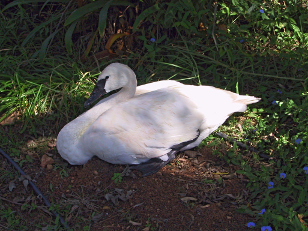

# Enhancing HDR
The Keras Implementation of the [Deep HDR Imaging via A Non-Local Network](https://ieeexplore.ieee.org/document/8989959) - TIP 2020
## Content
- [Enhancing HDR](#enhancing-hdr)
- [Getting Started](#getting-tarted)
- [Running](#running)
- [References](#references)
- [Citations](#citation)

## Getting Started

- Clone the repository

### Prerequisites
- opencv
- Python 3.6+
- Keras 2.3.0
- numpy

```python
pip install -r requirements.txt
```

## Running
### Training 
    ```
    python main.py
    ```
## Usage
### Training
```
usage: main.py [-h] [--image_path IMAGES_PATH]
               [--filter True]
```

```
optional arguments: -h, --help                show this help message and exit
                    --images_path             path to image
                    --filter                  use guided filter or weighted least square filter
```

#### Result
 |  |
|:---:|:---:|
 |  |
| input | output |

## License

This project is licensed under the MIT License - see the [LICENSE](https://github.com/tuvovan/NHDRRNet/blob/master/LICENSE) file for details

## References
[1] Deep HDR Imaging via A Non-Local Network - TIP 2020 [link](https://ieeexplore.ieee.org/document/8989959)

[3] Training and Testing dataset - [link](https://cseweb.ucsd.edu/~viscomp/projects/SIG17HDR/)

## Citation
```
    @ARTICLE{8989959,  author={Q. Yan and L. Zhang and Y. Liu and Y. Zhu and J. Sun and Q. Shi and Y. Zhang},  
    journal={IEEE Transactions on Image Processing},   
    title={Deep HDR Imaging via A Non-Local Network},   
    year={2020},  
    volume={29},  
    number={},  
    pages={4308-4322},}
```
## Acknowledgments
- This work based on the paper mentioned above with the following modification:
    - replacing the weighted least square filter by guided filter to enhance the speed.
- Any ideas on updating or misunderstanding, please send me an email: <vovantu.hust@gmail.com>
- If you find this repo helpful, kindly give me a star.